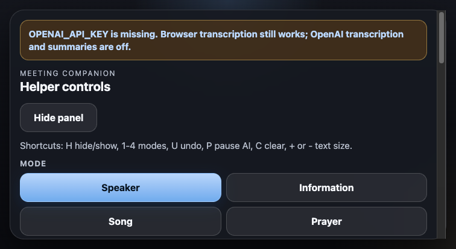

# Meeting Companion Display

Meeting Companion Display is a small local helper app for church meetings.

It runs on a laptop connected to a TV and shows a large-print stack of digestible transcript cards for one deaf and low-vision viewer. The helper uses a side rail that fills the laptop window to type manual lines, adjust the viewing size, change the margins, and slow down or speed up AI updates when the room pace changes. Less-frequent settings live in a separate Settings disclosure, and live status text plus transcript tools live in Diagnostics.



## What it does

- Shows a scrollable stack of large-print transcript cards on the TV.
- New items appear at the bottom and older items move up.
- Manual lines appear immediately.
- Helper can choose modes: Speaker, Information, Song, Prayer.
- Helper can choose transcription source: Browser or OpenAI from Settings.
- Helper can choose summarization source: OpenAI or Claude from Settings.
- Helper can adjust text size, margins, and update interval.
- Helper can undo, clear, pause AI, and collapse the extras with `H`.
- Quick controls stay visible.
- Settings keeps source controls out of the main operating surface.
- Diagnostics keeps status, transcript tools, and recent transcript text separate from the live controls.
- No database.
- No saved transcript or audio by default.
- The screen stays readable from across the room.

## Run it

1. Install Node.js 18 or newer.
2. Open this folder in a terminal.
3. Run:

```bash
npm install
npm start
```

4. Open [http://localhost:3000](http://localhost:3000).
5. Connect the laptop to the TV and make the browser fullscreen.
6. Press `H` to hide or show the extras.
7. Allow microphone access only if you want live browser transcription.
8. If `OPENAI_API_KEY` is missing, the app shows a warning and stays usable in manual mode and browser transcription mode.
9. If `ANTHROPIC_API_KEY` is missing, Claude summaries stay disabled.

## Setup

Create a `.env` file in the project root:

```text
OPENAI_API_KEY=your_api_key_here
ANTHROPIC_API_KEY=your_anthropic_key_here
ANTHROPIC_MODEL=claude-3-5-sonnet-latest
PORT=3000
```

The app stays local. It does not save audio or transcripts unless you add that later.

## Sunday use

1. Start the app before the meeting and open it fullscreen.
2. Keep the TV on the large-print display and the helper panel on the laptop.
3. Use `Speaker` mode for sermons and stories.
4. Use `Information` mode for dates, times, places, hymn numbers, assignments, and announcements.
5. Use `Song` mode for hymn or song status only.
6. Use `Prayer` mode for prayer status only.
7. Use `Browser` transcription first if the browser supports speech recognition.
8. Switch to `OpenAI` transcription if you want the server-backed path.
9. Type a manual line and press Enter if something needs to appear immediately.
10. Use `Undo` if the last line was wrong.
11. Use `Pause AI` if summaries are getting noisy.
12. Adjust `Text size`, `Margins`, or `Update interval` if the TV distance or pace changes.

## Keyboard shortcuts

- `H` hide or show the extras
- `1` Speaker mode
- `2` Information mode
- `3` Song mode
- `4` Prayer mode
- `U` Undo
- `C` Clear
- `P` Pause or resume AI
- `Ctrl+Enter` summarize pasted transcript

## AI rules

- Speaker mode should summarize the specific story, event, teaching, feeling, invitation, or example.
- Information mode should prioritize exact dates, times, places, hymn numbers, assignments, and announcements.
- Song mode should only show hymn or song status.
- Prayer mode should not summarize line by line.
- AI should only add a line when something useful changed.

## Accessibility and design

- The TV display is the priority surface.
- The helper panel is for quick operation, not assistive reading.
- The interface uses large type, wide controls, and a high-contrast dark surface.
- The display and controls are designed to stay readable at a distance and easy to adjust under pressure.
- The helper controls are dense on purpose, but each control stays labeled and keyboard accessible.
- The helper panel groups live controls, Settings, and Diagnostics so the operator does not have to parse everything at once.

## Docs

- [Specs index](docs/00-index.md)
- [Implementation plan](docs/plans/helper-panel-reorganization/README.md)
- [Public wiki](public/wiki/index.html)
- [Wiki starter](wiki/Home.md)
