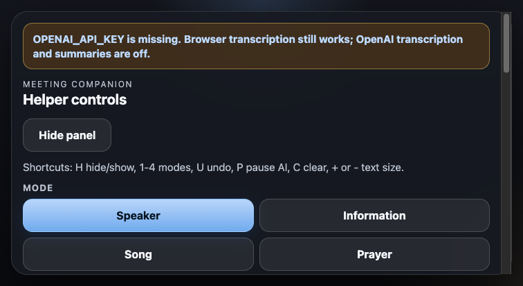

# Meeting Companion Display

Meeting Companion Display is a small local helper app for church meetings.

It runs on a laptop connected to a TV and shows a large-print stack of digestible transcript cards for one deaf and low-vision viewer. The helper uses a slim operator rail for the live controls, a bottom bar for manual lines, and a centered Settings modal for transcription source, summarization source, provider keys, alerts, and diagnostics. The TV display stays the visual hero.



## What it does

- Shows a scrollable stack of large-print transcript cards on the TV.
- New items appear at the bottom and older items move up.
- Manual lines appear immediately, can be edited or deleted in place, and undo brings the last removed line back.
- Helper can choose modes: Speaker, Information, Song, Prayer.
- Helper can choose transcription source in Settings: Browser (local, no key), OpenAI (server-backed, once a key is added), Demo (a sample meeting for rehearsing the display), or Replay (re-drives a recorded session, for testing only, not live audio).
- Helper can choose summarization source in Settings: OpenAI, Claude, or Demo (trims real transcript text with no API key, for rehearsal).
- Helper can save, test, replace, or delete provider keys in Settings. Keys are held in the server's memory for the running session only, never written to disk and never sent to the browser.
- Controls that would silently change what the pipeline is doing (source, provider keys, mic device, the recording checkbox) lock while a real microphone is live, with a reason shown on hover. They unlock on Pause, since nothing is capturing at that point, and always on Stop. Text size, margins, and pace controls stay live throughout, since adjusting for the room is the point of having them.
- Helper can build a per-meeting program (name and mode for each part), which powers speaker-name suggestions and lets a program entry be sent as a header card.
- A reading-pace calibration ([`reading-pace.html`](public/reading-pace.html)) measures a specific viewer's actual reading speed and saves it as a named profile, so pacing is measured, not assumed.
- Helper can adjust text size, margins, and update interval.
- Helper can undo, clear, and pause AI from the operator rail, and collapse the rail to icons-only to save space.
- Quick controls stay visible.
- The operator rail can show a small live transcript preview so the helper can see the raw stream coming in.
- Settings keeps source controls, provider keys, alerts, and diagnostics out of the main operating surface.
- The operator rail stays icon-first and compact so the display remains the focus.
- No database.
- No audio is ever saved. Transcript and summary text (including manual lines, edits, and deletions) **is** written to a local, gitignored file per session by default, so a meeting can be replayed later for tuning. Turn it off with the "Record session" checkbox in Settings. Nothing leaves the machine, and it's only ever read back over a loopback request on the same one. See [ADR-0003](docs/decisions/0003-no-audio-storage-by-default.md) and [ADR-0004](docs/decisions/0004-session-recording-for-tuning.md).
- The screen stays readable from across the room.

## Run it

1. Install Node.js 18 or newer.
2. Open this folder in a terminal.
3. Run:

```bash
npm install
npm start
```

4. Open [http://localhost:3000](http://localhost:3000).
5. For a live-looking preview with sample transcript cards, open [http://localhost:3000/?demo=1](http://localhost:3000/?demo=1).
6. Connect the laptop to the TV and make the browser fullscreen.
7. Allow microphone access only if you want live browser transcription.
8. If `OPENAI_API_KEY` is missing, the app shows a warning and stays usable in manual mode and browser transcription mode.
9. If `ANTHROPIC_API_KEY` is missing, Claude summaries stay disabled.

## Setup

Create a `.env` file in the project root:

```text
OPENAI_API_KEY=your_api_key_here
ANTHROPIC_API_KEY=your_anthropic_key_here
OPENAI_MODEL=gpt-4o-mini
ANTHROPIC_MODEL=claude-haiku-4-5-20251001
PORT=3000
HOST=127.0.0.1
ALLOW_REMOTE_HOST=false
```

Only `OPENAI_API_KEY` and `ANTHROPIC_API_KEY` are required; everything else has a working default. The app refuses to bind to anything but loopback unless `ALLOW_REMOTE_HOST=true` is set explicitly.

The app stays local. It never saves audio, and it does save transcript and summary text to a local file by default, for tuning (see [ADR-0004](docs/decisions/0004-session-recording-for-tuning.md)). Provider keys are stored on the local server for the running session, not in browser storage.

### Push gates (one-time, per clone)

Git will not run hooks it fetched from a repo, so this is opt-in and you have to do it once after
cloning:

```bash
git config core.hooksPath .githooks
```

That turns on `.githooks/pre-push`, which runs the test suite and the code-map queue check before
anything leaves your machine. Each gate runs separately, so a failure in one cannot hide the other.
`--no-verify` still skips the whole hook if you really need it to.

## Sunday use

1. Start the app before the meeting and open it fullscreen.
2. Keep the TV on the large-print display and the helper panel on the laptop.
3. Use `Speaker` mode for sermons and stories.
4. Use `Information` mode for dates, times, places, hymn numbers, assignments, and announcements.
5. Use `Song` mode for hymn or song status only.
6. Use `Prayer` mode for prayer status only.
7. Use `Browser` transcription first if the browser supports speech recognition.
8. Switch to `OpenAI` transcription if you want the server-backed path.
9. Type a manual line and press Enter if something needs to appear immediately.
10. Use `Undo` if the last line was wrong.
11. Use `Pause AI` if summaries are getting noisy.
12. Adjust `Text size`, `Margins`, or `Update interval` if the TV distance or pace changes.

## Keyboard shortcuts

- `1` Speaker mode
- `2` Information mode
- `3` Song mode
- `4` Prayer mode
- `U` Undo
- `P` Pause or resume AI
- `/` focus the manual-entry field
- `Escape` close whichever panel is open (view, quick controls, or Settings), or cancel an armed Clear
- `Ctrl+Enter` (or `Cmd+Enter`) summarize pasted transcript, from inside the paste box

Clear has its own click-to-arm, click-to-confirm button (no keyboard shortcut). The rail can collapse to icons-only from its own button; no keypress hides the whole panel any more.

## AI rules

- Speaker mode should summarize the specific story, event, teaching, feeling, invitation, or example.
- Information mode should prioritize exact dates, times, places, hymn numbers, assignments, and announcements.
- Song mode should only show hymn or song status.
- Prayer mode should not summarize line by line.
- AI should only add a line when something useful changed.

## Accessibility and design

- The TV display is the priority surface.
- The helper panel is for quick operation, not assistive reading.
- The interface uses large type, wide controls, and a high-contrast dark surface.
- The display and controls are designed to stay readable at a distance and easy to adjust under pressure.
- The helper controls are dense on purpose, but each control stays labeled and keyboard accessible.
- The helper surface is split into a live operator rail, a manual input bar, and a Settings modal so the operator does not have to parse everything at once.

## Docs

- [Specs index](docs/00-index.md)
- [Architecture decisions](docs/decisions/README.md) (why the app is shaped this way: source registry, no audio persistence, session recording for tuning, and the multi-viewer draft)
- [Implementation plan](docs/plans/helper-panel-reorganization/README.md)
- [Public wiki page](public/wiki/index.html)
- [Wiki](https://github.com/senigami/meeting-companion/wiki) (quick start, the Sunday runbook, a pre-live checklist, accessibility notes)
