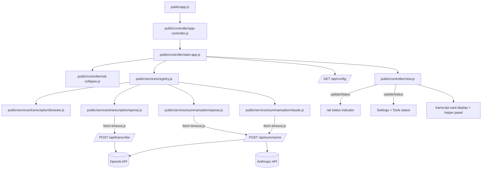

# System Architecture

> **TL;DR:** Express serves a static client and a small JSON API. The client owns the display state and talks to source-specific drivers through a registry so browser, OpenAI, and Claude paths stay interchangeable.

## Overview

The architecture has three layers: the server, the client controller, and the source modules. The server is intentionally thin. It serves `public/`, exposes runtime config, validates locally stored provider keys on demand, and proxies OpenAI transcription plus OpenAI or Claude summarization requests. It does not store state.

The client owns the UI state, keyboard shortcuts, and rendering of the transcript-card display. It loads source metadata from the registry, shows only configured services in the source selectors, and uses a separate registration flow to add provider keys before a source appears in the available list. The Settings surface (`<dialog id="settingsPanel">`) is a master-detail layout: a `.settingsNav` list of plain-language sections (Alerts, Timing, Transcription, Summaries, AI services, Tools) selects which single `.settingsDetail` section is visible, mirroring macOS System Settings rather than one long scrolling panel.

Source modules are the modular boundary. Browser transcription and OpenAI transcription are both transcription drivers. OpenAI and Claude are summarization drivers. Adding a new provider should mean adding a new module and registering it, not changing the display logic.

The UI uses Lucide-backed SVG symbols for generic controls like settings, alerts, undo, fullscreen, trash, pause, stop, and microphone. Church-specific icons such as speaker, information, song, prayer, and manual stay as custom SVGs when the hand-tuned symbol is a better semantic fit.

The client's CSS is split into two token tiers so the TV display and the operator chrome can change independently: TV canvas tokens (`--bg`, `--text`, `--panel`, `--accent`, `--muted`, `--font-size`, and related transcript-card values) stay frozen and untouched by chrome work, while a separate `--chrome-*` tier (dark macOS-style surfaces, `#0A84FF` accent, 6/10/12px radii) is the only source colors/radii/spacing come from in the rail, Settings modal, view drawer, and manual bar. Chrome surfaces are intentionally flat, with no blur or glass effects.

## Big picture flow

## Parts

| Part | Responsibility | Lives in | Status |
| --- | --- | --- | --- |
| P1 - Display controller | Owns UI state, keyboard shortcuts, line rendering, and panel visibility | `public/controller/app-controller.js`, `public/controller/start-app.js`, `public/controller/runtime.js`, `public/controller/view.js` | existing |
| P2 - Source catalog and registry | Lists available sources and instantiates drivers by stable id | `public/services/catalog.js`, `public/services/registry.js` | existing |
| P3 - Browser transcription driver | Wraps the Web Speech API behind the shared driver shape | `public/services/transcription/browser.js` | existing |
| P4 - OpenAI transcription driver | Sends short audio chunks to the server and emits final text | `public/services/transcription/openai.js` | existing |
| P5 - OpenAI summarizer | Sends recent transcript text to the server and returns one useful line | `public/services/summarization/openai.js` | existing |
| P5b - Claude summarizer | Sends recent transcript text to the server and returns one useful line | `public/services/summarization/claude.js` | existing |
| P6 - Server API | Serves static files, reports runtime config, validates provider keys, proxies transcription and summarization to provider APIs | `server.js` | existing |
| P7 - Docs and tests | Keeps specs, ADRs, plan files, and mirrored tests aligned with code | `docs/`, `test/` | new/updated |
| P8 - Rail collapse | Toggles the operator rail between its full width and a 64px icon-only strip, persists the choice, and interoperates with rail resizing | `public/controller/rail-collapse.js` | new |
| P9 - Fetch timeout wrapper | Wraps the three network call sites with an `AbortController`-based timeout so a stalled provider request cannot hang the UI | `public/services/fetch-timeout.js` | new |
| P10 - Status pipeline | Single `updateStatus(ctx, text, { level })` write point that renders the diagnostics status line in Settings > Tools and the always-visible rail status indicator (dot + word) together | `public/controller/view.js` | changed |

## Connections

| From | To | Connection | What must stay true |
| --- | --- | --- | --- |
| P1 | P2 | `createTranscriptionDriver(source, deps)` / `createSummarizationDriver(source, deps)` | Driver ids must stay stable and the driver shape must remain `{ start, stop }` or `{ summarize }`. |
| P1 | P3 | Browser transcription event stream | Browser events must normalize text and emit `final` or `partial` updates. |
| P1 | P4 | OpenAI transcription driver stream | OpenAI chunks must remain short and final text must arrive in order. |
| P1 | P5 | Summary request | The summarizer must keep returning at most one line or an empty result. |
| P1 | P5b | Summary request | Claude summarization must keep returning at most one line or an empty result. |
| P4 | P6 | `/api/transcribe` | The server must accept base64 audio, mode, and mime type, and return `{ text }`. |
| P5 | P6 | `/api/summarize` | The server must accept transcript text and visible lines, then return `{ line }`. |
| P1 | P6 | `/api/config` | The client must be able to detect whether OpenAI or Anthropic is configured and hide unavailable source options until they are registered. |
| P1 | P6 | `/api/provider/test` | The client must be able to test a candidate OpenAI or Claude key without exposing the secret back to the UI. |
| P8 | P1 | `#railCollapseToggle` sets `html.is-rail-collapsed` and writes `--operator-rail-width` | Collapsing must genuinely narrow the grid track so the TV display widens; the collapsed choice persists in `localStorage` (`operatorRailCollapsed`) and defaults to expanded; it is a desktop-only feature (inert at narrow viewport widths). |
| P4, P5, P5b | P9 | Transcribe/summarize/provider-test fetches | Each of the three network call sites (`/api/transcribe`, `/api/summarize`, `/api/provider/test`) is wrapped with a ~12 second timeout so a stalled request surfaces as a failure instead of hanging. |
| P10 | P1 | `updateStatus(ctx, text, { level })` | Remains the single write point for status; it must keep updating both the Settings > Tools diagnostics line and the rail status indicator (dot + word: Listening/Paused/Manual/Problem) together. |

## Invariants & things to keep in mind

- **INV-1** - The TV display always shows a bounded stack of transcript cards and only the newest items remain in view.
- **INV-2** - Manual lines must appear immediately and must not wait on AI.
- **INV-3** - Source ids are public contract values; adding a source means adding it to the catalog and registry together, and adding a service key should promote that source into the available selector.
- **INV-4** - Browser transcription is optional and must fail gracefully when the browser lacks the API.
- **INV-5** - OpenAI features must stay off when `OPENAI_API_KEY` is missing.
- **INV-6** - Claude summaries must stay off when `ANTHROPIC_API_KEY` is missing.
- **INV-7** - On startup, the runtime must switch summarization to a configured provider when the selected source is unavailable or stale.
- **INV-8** - The app does not persist audio or transcript history by default.
- **INV-9** - The TV canvas tokens (`--bg`, `--text`, `--panel`, `--accent`, `--muted`, `--font-size`) stay separate from the `--chrome-*` tier; operator chrome restyling must never require changing TV canvas rules.

## Risks & open questions

- Browser speech recognition support varies by browser. The UI must keep a manual fallback and not assume it exists.
- OpenAI transcription uses chunked audio upload, so chunk timing and network latency can affect live feel.
- If a future provider is added, the registry and catalog need to be the only places where the new source appears first.

## Related specs

- [docs/04-api-conventions.md](04-api-conventions.md) - endpoint and payload shapes.
- [docs/05-code-organization.md](05-code-organization.md) - folder boundaries and mirrored tests.
- [docs/07-ai-and-privacy.md](07-ai-and-privacy.md) - source behavior and data handling rules.
