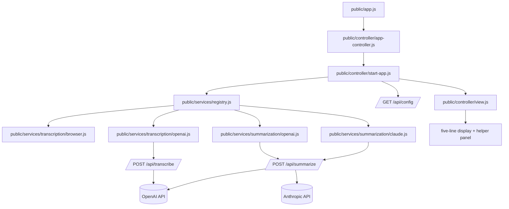

# System Architecture

> **TL;DR:** Express serves a static client and a small JSON API. The client owns the display state and talks to source-specific drivers through a registry so browser, OpenAI, and Claude paths stay interchangeable.

## Overview

The architecture has three layers: the server, the client controller, and the source modules. The server is intentionally thin. It serves `public/`, exposes runtime config, and proxies OpenAI transcription plus OpenAI or Claude summarization requests. It does not store state.

The client owns the UI state, keyboard shortcuts, and rendering of the five-line display. It loads source metadata from the registry and creates transcription and summarization drivers based on the helper's chosen source.

Source modules are the modular boundary. Browser transcription and OpenAI transcription are both transcription drivers. OpenAI and Claude are summarization drivers. Adding a new provider should mean adding a new module and registering it, not changing the display logic.

## Big picture flow

## Parts

| Part | Responsibility | Lives in | Status |
| --- | --- | --- | --- |
| P1 - Display controller | Owns UI state, keyboard shortcuts, line rendering, and panel visibility | `public/controller/app-controller.js`, `public/controller/start-app.js`, `public/controller/runtime.js`, `public/controller/view.js` | existing |
| P2 - Source catalog and registry | Lists available sources and instantiates drivers by stable id | `public/services/catalog.js`, `public/services/registry.js` | existing |
| P3 - Browser transcription driver | Wraps the Web Speech API behind the shared driver shape | `public/services/transcription/browser.js` | existing |
| P4 - OpenAI transcription driver | Sends short audio chunks to the server and emits final text | `public/services/transcription/openai.js` | existing |
| P5 - OpenAI summarizer | Sends recent transcript text to the server and returns one useful line | `public/services/summarization/openai.js` | existing |
| P5b - Claude summarizer | Sends recent transcript text to the server and returns one useful line | `public/services/summarization/claude.js` | existing |
| P6 - Server API | Serves static files, reports runtime config, proxies transcription and summarization to provider APIs | `server.js` | existing |
| P7 - Docs and tests | Keeps specs, ADRs, plan files, and mirrored tests aligned with code | `docs/`, `test/` | new/updated |

## Connections

| From | To | Connection | What must stay true |
| --- | --- | --- | --- |
| P1 | P2 | `createTranscriptionDriver(source, deps)` / `createSummarizationDriver(source, deps)` | Driver ids must stay stable and the driver shape must remain `{ start, stop }` or `{ summarize }`. |
| P1 | P3 | Browser transcription event stream | Browser events must normalize text and emit `final` or `partial` updates. |
| P1 | P4 | OpenAI transcription driver stream | OpenAI chunks must remain short and final text must arrive in order. |
| P1 | P5 | Summary request | The summarizer must keep returning at most one line or an empty result. |
| P1 | P5b | Summary request | Claude summarization must keep returning at most one line or an empty result. |
| P4 | P6 | `/api/transcribe` | The server must accept base64 audio, mode, and mime type, and return `{ text }`. |
| P5 | P6 | `/api/summarize` | The server must accept transcript text and visible lines, then return `{ line }`. |
| P1 | P6 | `/api/config` | The client must be able to detect whether OpenAI or Anthropic is configured and disable unavailable options. |

## Invariants & things to keep in mind

- **INV-1** - The TV display always shows five lines and only the five newest lines.
- **INV-2** - Manual lines must appear immediately and must not wait on AI.
- **INV-3** - Source ids are public contract values; adding a source means adding it to the catalog and registry together.
- **INV-4** - Browser transcription is optional and must fail gracefully when the browser lacks the API.
- **INV-5** - OpenAI features must stay off when `OPENAI_API_KEY` is missing.
- **INV-6** - Claude summaries must stay off when `ANTHROPIC_API_KEY` is missing.
- **INV-7** - On startup, the runtime must switch summarization to any configured provider instead of leaving a missing source selected.
- **INV-8** - The app does not persist audio or transcript history by default.

## Risks & open questions

- Browser speech recognition support varies by browser. The UI must keep a manual fallback and not assume it exists.
- OpenAI transcription uses chunked audio upload, so chunk timing and network latency can affect live feel.
- If a future provider is added, the registry and catalog need to be the only places where the new source appears first.

## Related specs

- [docs/04-api-conventions.md](04-api-conventions.md) - endpoint and payload shapes.
- [docs/05-code-organization.md](05-code-organization.md) - folder boundaries and mirrored tests.
- [docs/07-ai-and-privacy.md](07-ai-and-privacy.md) - source behavior and data handling rules.
