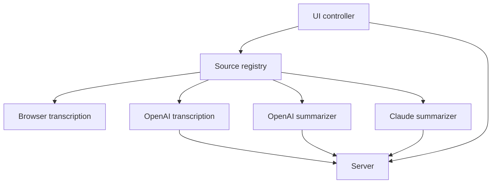

# Implementation Map - Church Helper Local AI Wrapper

> **TL;DR:** The app has one display controller, one source registry, two transcription drivers, two summarizers, and one thin server. The point of the map is to keep those seams stable while the helper UI stays simple.

## Big picture

The current build keeps the TV display and helper controls in a plain browser UI, with source-specific transcription and summarization hidden behind a stable registry. Browser transcription is the local-first path; OpenAI transcription plus OpenAI or Claude summarization are opt-in and server-backed. The server should remain thin and only expose runtime config plus provider proxy routes. The rest of the app is a client state machine that turns input into a readable stack of transcript cards.

## The parts

| Part | Responsibility | Lives in (path/area) | Status |
| --- | --- | --- | --- |
| P1 - UI controller | Owns state, keyboard shortcuts, display rendering, and helper actions | `public/controller/app-controller.js`, `public/controller/start-app.js`, `public/controller/runtime.js`, `public/controller/view.js` | existing |
| P2 - Source catalog | Lists available source ids and labels | `public/services/catalog.js` | existing |
| P3 - Source registry | Creates the requested transcription or summarization driver | `public/services/registry.js` | existing |
| P4 - Browser transcription driver | Wraps Web Speech API events into the shared driver shape | `public/services/transcription/browser.js` | existing |
| P5 - OpenAI transcription driver | Captures short audio chunks and posts them to the server | `public/services/transcription/openai.js` | existing |
| P6 - OpenAI summarizer | Posts recent transcript text to the server and returns one line | `public/services/summarization/openai.js` | existing |
| P6b - Claude summarizer | Posts recent transcript text to the server and returns one line | `public/services/summarization/claude.js` | existing |
| P7 - Server endpoints | Serve config, transcription, and summarization | `server.js` | existing |
| P8 - Specs/tests/docs | Keep the contract current and searchable | `docs/`, `test/` | new |

## The connections

| From | To | Connection (contract / data / event / call) | What must stay true |
| --- | --- | --- | --- |
| P1 | P3 | `createTranscriptionDriver(source, deps)` and `createSummarizationDriver(source, deps)` | Source ids must remain stable and provider code must stay behind the registry. |
| P1 | P4 | Browser transcription event callback | Browser events must produce normalized `final` and `partial` text. |
| P1 | P5 | OpenAI transcription start/stop cycle | Audio chunks must remain short and final text must arrive in order. |
| P1 | P6 | Summarize call | The OpenAI summarizer must return one useful line or nothing. |
| P1 | P6b | Summarize call | The Claude summarizer must return one useful line or nothing. |
| P5 | P7 | `POST /api/transcribe` | The server must accept base64 audio and return `{ text }`. |
| P6 | P7 | `POST /api/summarize` | The server must accept transcript text and visible lines and return `{ line }`. |
| P1 | P7 | `GET /api/config` | The UI must be able to disable unavailable OpenAI and Claude options. |

## Invariants & things to keep in mind

- **INV-1** - The display always shows a readable stack of transcript cards, and the newest item belongs at the bottom.
- **INV-2** - Manual lines must appear immediately.
- **INV-3** - Source ids are stable contract values, not display labels.
- **INV-4** - OpenAI features must stay disabled when the API key is missing.
- **INV-5** - Claude summaries must stay disabled when the Anthropic API key is missing.
- **INV-6** - No audio or transcript persistence by default.

## Risks & open questions

- Browser speech support is uneven across browsers, so the manual path must stay obvious.
- The OpenAI transcription path depends on short chunk timing and network reliability.
- If a future provider is added, it should be added by extending the registry, not by adding provider branching back into the UI.
