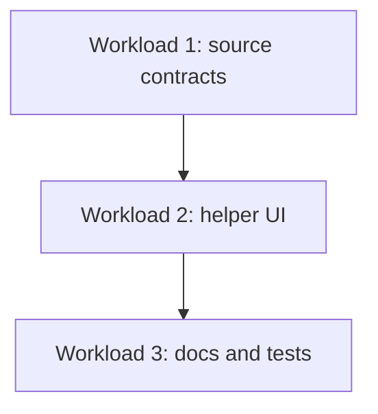

# Roadmap

> **TL;DR:** Three workloads: lock the source contracts, finish the helper UI ergonomics, then finish docs/tests and verification.

## Sequencing rationale

The registry and source contracts come first because everything else depends on them. The helper UI sits on top of those contracts. Docs, plan files, and mirrored tests come last because they should document the stable shape after the implementation settles.

## Dependency graph

## Workloads

### Workload 1 - Source contracts

- **Goal:** Keep the standardized wrapper stable for transcription and summarization.
- **Tasks:** 001
- **Touches (map parts):** P2, P3, P4, P5, P6, P7
- **Why now:** The UI cannot rely on source ids or driver shapes until they are fixed.
- **Verify the workload:** `npm test` plus a config check that OpenAI is detected correctly.

### Workload 2 - Helper UI

- **Goal:** Keep the helper panel keyboard-friendly and readable from a distance.
- **Tasks:** 002
- **Touches (map parts):** P1, P7
- **Why now:** The UI must consume the source contracts without provider branching.
- **Verify the workload:** The browser renders the transcript-card display and helper controls without module errors.

### Workload 3 - Docs and tests

- **Goal:** Make the codebase navigable for humans and small agents.
- **Tasks:** 003
- **Touches (map parts):** P8
- **Why now:** The code is already in place; the last step is to codify the shape and keep tests mirrored.
- **Verify the workload:** Specs exist, ADRs exist, `AGENTS.md` points to the index, and tests mirror the source tree.
