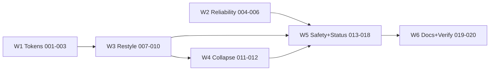

# Roadmap — Desktop Operator Redesign

> Order is dependency-driven. W1 and W2 are independent and safely parallel. W3 needs W1. W4 needs W3's settled rail markup. W5 needs W3/W4 markup. W6 is last.

## Dependency graph

## W1 — Chrome token foundation (parallel with W2)

- [x] 001 — Add `--chrome-*` token tier (aliased near-current values) + style-test token pins — `tasks/001-chrome-token-tier.md`
- [x] 002 — Repoint `controls.css` literals to chrome tokens — `tasks/002-repoint-controls-css.md`
- [x] 003 — Repoint `settings.css` (+ rail chrome bits of `layout.css`/`responsive.css`) — `tasks/003-repoint-settings-css.md`

## W2 — Reliability hardening (parallel with W1)

- [x] 004 — Fetch timeouts on the three network call sites — `tasks/004-fetch-timeouts.md`
- [x] 005 — Summarize failure counter, alert escalation, one-step backoff — `tasks/005-failure-counter-backoff.md`
- [x] 006 — Browser-speech restart visibility + delete dead `getApiKey` params — `tasks/006-speech-visibility-dead-param.md`

## W3 — macOS chrome restyle (after W1)

- [x] 007 — Chrome token values → macOS palette; surface/material restyle (flat, hairlines, radii, focus, type scale) — `tasks/007-chrome-surfaces.md`
- [x] 008 — Button consolidation + segmented-style mode group — `tasks/008-buttons-and-modes.md`
- [x] 009 — Sliders + view drawer + manual bar detail restyle — `tasks/009-sliders-drawer-manualbar.md`
- [x] 010 — Settings modal → System-Settings-style master-detail (HTML+CSS+JS+tests) — `tasks/010-settings-master-detail.md`

## W4 — Collapsible rail (after W3)

- [x] 011 — `rail-collapse.js` core: toggle button, collapsed CSS state, persistence, tests — `tasks/011-rail-collapse-core.md`
- [x] 012 — Collapse polish: double-click snap, resize interplay, transitions, tooltips audit — `tasks/012-rail-collapse-polish.md`

## W5 — Safety, workflow, status, pre-flight (after W3/W4)

- [x] 013 — Safe Clear: two-stage confirm, snapshot restore, remove bare `C` — `tasks/013-safe-clear.md`
- [x] 014 — `/` focus hotkey + undo feedback — `tasks/014-focus-hotkey-undo-feedback.md`
- [x] 015 — Loud paused state + honest pause wording — `tasks/015-loud-pause.md`
- [x] 016 — Rail status indicator (dot + word) + TV inactive-card opacity tweak — `tasks/016-rail-status-indicator.md`
- [x] 017 — Lean Ready check (mic / AI / display sample) — `tasks/017-ready-check.md`
- [x] 018 — Workflow keyboard polish + shortcut badge cleanup — `tasks/018-shortcut-polish.md`
- [x] 021 — Vertical responsiveness for the operator chrome (user-requested addition) — `tasks/021-vertical-responsiveness.md`

## W6 — Close-out

- [x] 019 — Reconcile `docs/` specs with shipped behavior — `tasks/019-docs-reconcile.md`
- [x] 020 — Final verification sweep (full tests + manual smoke checklist + TV-freeze audit vs `ff78760`) — `tasks/020-final-verification.md`

## Milestones

1. **M1 (end W1+W2):** visually near-identical app, tokenized chrome, hardened providers — suite green.
2. **M2 (end W3):** the app *looks* like a dark Mac desktop app.
3. **M3 (end W4):** rail collapses/expands and persists.
4. **M4 (end W5):** safe, glanceable, pre-flightable.
5. **M5 (end W6):** docs truthful, everything verified.
