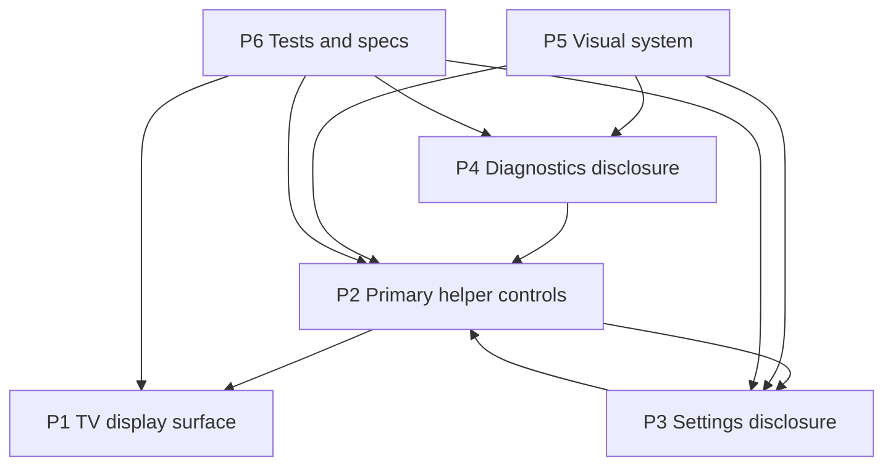

# Implementation Map — Helper Panel Reorganization

> **TL;DR:** Keep the runtime contracts stable while changing the panel information architecture: primary controls stay visible, settings and diagnostics become secondary disclosure regions, and tests/docs verify the new layout.

## Big Picture

The app is a tiny local Express-served static UI. This plan does not change the server, source registry, provider adapters, or transcript-card display. It changes how existing helper controls are grouped so the operator sees fewer competing choices during a meeting.

The safest approach is progressive disclosure with native HTML where possible. Move configuration controls into a Settings disclosure and runtime feedback into a Diagnostics disclosure while preserving ids, class hooks, and `data-*` attributes used by the controller. Styling should make the visible operating surface cleaner without making the controller depend on JS-only layout behavior.

## The Parts

| Part | Responsibility | Lives in | Status |
| --- | --- | --- | --- |
| P1 — TV display surface | Shows a readable stack of viewer-facing transcript cards, no labels. | `public/index.html`, `public/style.css`, `public/controller/view.js` | existing |
| P2 — Primary helper controls | Controls the live meeting flow: modes, manual line, start/stop/pause, undo, clear, viewer size/margins/interval, fullscreen. | `public/index.html`, `public/style.css`, `public/controller/start-app.js`, `public/controller/runtime.js`, `public/controller/view.js` | changed |
| P3 — Settings disclosure | Houses lower-frequency configuration: transcription source and summary source. | `public/index.html`, `public/style.css`, controller DOM queries | new/changed |
| P4 — Diagnostics disclosure | Houses lower-frequency runtime feedback and transcript tools: status, recent transcript, and summarize-once/paste controls. | `public/index.html`, `public/style.css`, `public/controller/view.js` | new/changed |
| P5 — Visual system | Provides the Apple-inspired material, spacing, hierarchy, responsive behavior, and focus states. | `public/style.css` | changed |
| P6 — Tests and specs | Verifies DOM contracts, controller bindings, style contracts, and documents new behavior. | `test/public/`, `docs/` | changed |

## The Connections

| From | To | Connection | What Must Stay True |
| --- | --- | --- | --- |
| P2 | P1 | Helper actions mutate runtime state and call view renderers. | Manual lines still render immediately; display remains a readable stack of transcript cards with no labels. |
| P2 | P3 | Controller finds controls by ids and selectors such as `.mode`, `[data-kind="transcription"]`, and `[data-kind="summarization"]`. | Moving controls into Settings must not remove ids/classes/data attributes used by existing JS. |
| P2 | Runtime state | View sliders update `fontSize`, `displayMargin`, and `summaryIntervalSeconds`. | Existing localStorage keys and source ids remain stable: `browser`, `openai`, `claude`. |
| P4 | View updates | `updateStatus()` and transcript rendering target `#status` and `#liveTranscript`. | Those ids remain present even if hidden inside Diagnostics. |
| P5 | P2/P3/P4 | CSS class names define hierarchy, layout, active states, and focus. | New classes should not break current active button styles, focus-visible behavior, or responsive layout. |
| P6 | All parts | Tests assert DOM and behavior contracts. | Tests must mirror source layout and verify the new grouping without relying on brittle visual-only details. |

## Invariants & Things To Keep In Mind

- **INV-1** — The TV display always shows a readable stack of transcript cards, newest at the bottom, with no labels.
- **INV-2** — Manual typed lines must appear immediately and must not depend on AI pause or settings disclosure state.
- **INV-3** — Existing ids, classes, and `data-*` selectors used by JS stay stable unless code, tests, and docs change together.
- **INV-4** — Source choices and viewer sliders remain keyboard/click operable and persist through current localStorage keys.
- **INV-5** — Configuration and diagnostics are not constantly expanded by default; primary live controls remain visible.
- **INV-6** — Viewer adjustments for text size and margins remain quick to reach because the viewer may need rapid tuning in the room.
- **INV-7** — Accessibility basics hold across the panel: accessible names, visible focus, logical tab order, no keyboard trap, and native disclosure semantics when possible.
- **INV-8** — Keep the app tiny and local: no framework migration, no persistent audio/transcript storage, no provider rewrites.

## Risks & Open Questions

- **Risk — Hiding too much slows the operator.** Mitigation: keep viewer controls and primary live controls outside Settings; only move low-frequency configuration and diagnostics.
- **Risk — DOM reorganization breaks controller queries.** Mitigation: preserve ids, classes, and `data-*` attributes; add tests before implementation.
- **Risk — Visual polish adds brittle complexity.** Mitigation: use CSS-only hierarchy and native disclosure elements instead of new JS state unless a specific behavior requires it.
- **Open question — Should Settings open state persist?** Default answer for this plan: no. Keep it simple unless manual use shows persistence is needed.
