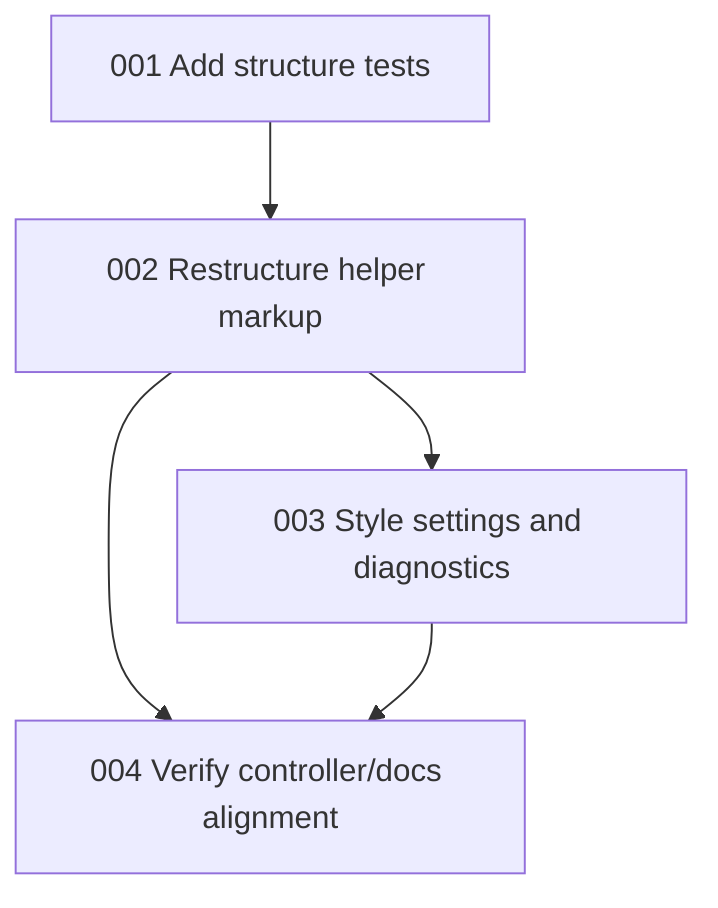

# Roadmap

> **TL;DR:** Four ordered slices: protect the DOM contract with tests, restructure markup, apply visual hierarchy, then finish controller/docs verification.

## Sequencing Rationale

The DOM contract is the risky edge because the controller binds controls by ids and selectors. Start by capturing the desired structure and existing binding expectations in tests. Then change markup, add styling, and finish with verification and docs alignment. This keeps visual work from drifting into runtime behavior changes.

## Dependency Graph

## Workloads

### Workload 1 — Contract Lock

- **Goal:** Add failing tests that describe the desired panel grouping and protect current controller selectors.
- **Tasks:** 001
- **Touches (map parts):** P2, P3, P4, P6
- **Why now:** Prevents the restructure from accidentally dropping ids, selectors, or accessibility semantics.
- **Verify the workload:** Run the targeted test and confirm it fails for the missing Settings/Diagnostics structure before implementation.

### Workload 2 — Markup Reorganization

- **Goal:** Move settings and diagnostics into secondary disclosure areas while preserving runtime hooks.
- **Tasks:** 002
- **Touches (map parts):** P2, P3, P4
- **Why now:** Establishes the new information architecture before visual refinement.
- **Verify the workload:** Targeted DOM/controller tests pass after markup changes.

### Workload 3 — Visual Hierarchy

- **Goal:** Polish the helper panel so primary actions are easier to scan and secondary sections feel intentional rather than hidden leftovers.
- **Tasks:** 003
- **Touches (map parts):** P2, P3, P4, P5
- **Why now:** Styling should apply to stable markup instead of driving the structure.
- **Verify the workload:** Style tests pass and manual/browser review confirms the panel is cleaner at laptop widths.

### Workload 4 — Integration And Docs

- **Goal:** Confirm behavior, keyboard access, tests, and specs all match the final structure.
- **Tasks:** 004
- **Touches (map parts):** P1, P2, P3, P4, P6
- **Why now:** Final pass catches contract drift after markup and styling land.
- **Verify the workload:** `npm test` and `git diff --check` pass.

